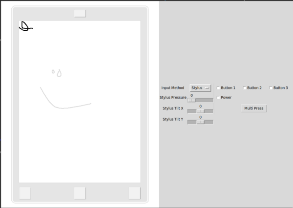

# remarkable_sim

## Install

Tkinter is a dependency. (`python3-tk` in Debian/Ubuntu)

    pip install remarkable-sim
    
## Usage

    resim
    
`resim` will create 3 FIFOs at `event0`, `event1`, and `event2` in the current directory and will attempt to read from `fb.pgm` 10 times per second.  The application under test should write to this framebuffer file and read evdev events from the FIFOs.
    
